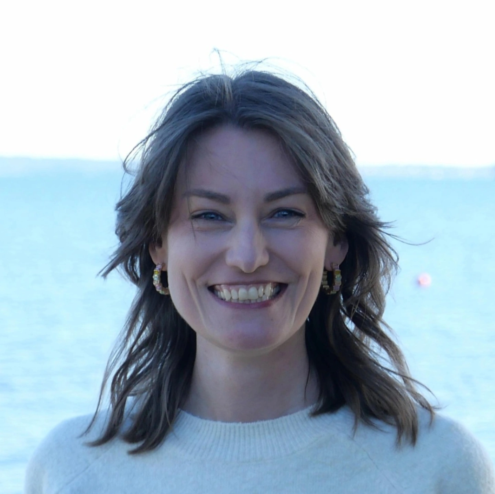

{width=250px .rounded-circle}

I’m Kiki Kuijjer, a digital scholarship practitioner, researcher and communicator with interests spanning cultural heritage, ocean sustainability and public engagement.

My background is interdisciplinary, combining archaeology with methods drawn from the ocean sciences. Since completing my PhD at the University of Southampton, I have worked across research, higher education, digital scholarship and international heritage networks.

I currently work in [Digital Scholarship](https://library.soton.ac.uk/digital-scholarship) at the University of Southampton, where I support digitisation workflows, specialist equipment use, digital scholarship services and processes that help make research and teaching materials more accessible and reusable. I also manage digital engagement for the [Ocean Decade Heritage Network](https://www.oceandecadeheritage.org/), helping to strengthen connections between cultural heritage, ocean science and sustainability within the [UN Ocean Decade](https://oceandecade.org/).

Through my work, I am particularly interested in how digital tools can make research, collections and knowledge more accessible, and in how different communities and knowledge systems can contribute to creating a more inclusive and sustainable future.

On this website you'll find information about my projects, blog posts on digital scholarship and ocean heritage, and occasional reflections on the intersections between culture, science and the sea.

