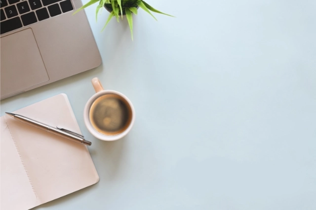

I’m starting this blog to share ideas and projects at the crossroads of digital scholarship and ocean heritage.

By day, I work in [Digital Scholarship](https://library.soton.ac.uk/digital-scholarship) at the University of Southampton helping make library collections more open, accessible, and engaging. I also support ocean advocacy through digital work with the [Ocean Decade Heritage Network](https://oceandecadeheritage.org).

This blog is a place for me to think out loud. Expect posts  research communication, digital tools, maybe some code, and probably a few ocean-related tangents too.

All views here are my own. 