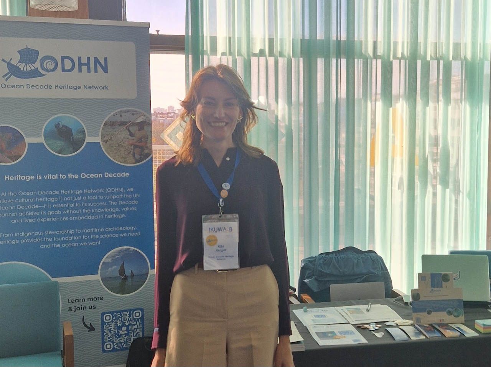

What role can underwater archaeology play in shaping how we understand and relate to the ocean today?

This question stayed with me after attending IKUWA8, a major international conference on underwater archaeology and cultural heritage. The conference brought together researchers, heritage practitioners, and policymakers working across a wide range of topics, from shipwreck archaeology and coastal heritage to climate change and ocean literacy.

What I found especially interesting was the recurring discussion around how underwater cultural heritage is positioned within wider ocean science and policy conversations. Many of the presentations returned to questions of storytelling, public engagement, and emotional connection, and to the idea that underwater archaeology is not only about documenting the past, but can also actively contribute to sustainability and to the long-term health and future of our oceans.

I wrote a short reflection on these themes for the Ocean Decade Heritage Network website, which you can read here: [Taking stock at IKUWA8 | Ocean Decade Heritage Network](https://www.oceandecadeheritage.org/taking-stock-at-ikuwa8/)

