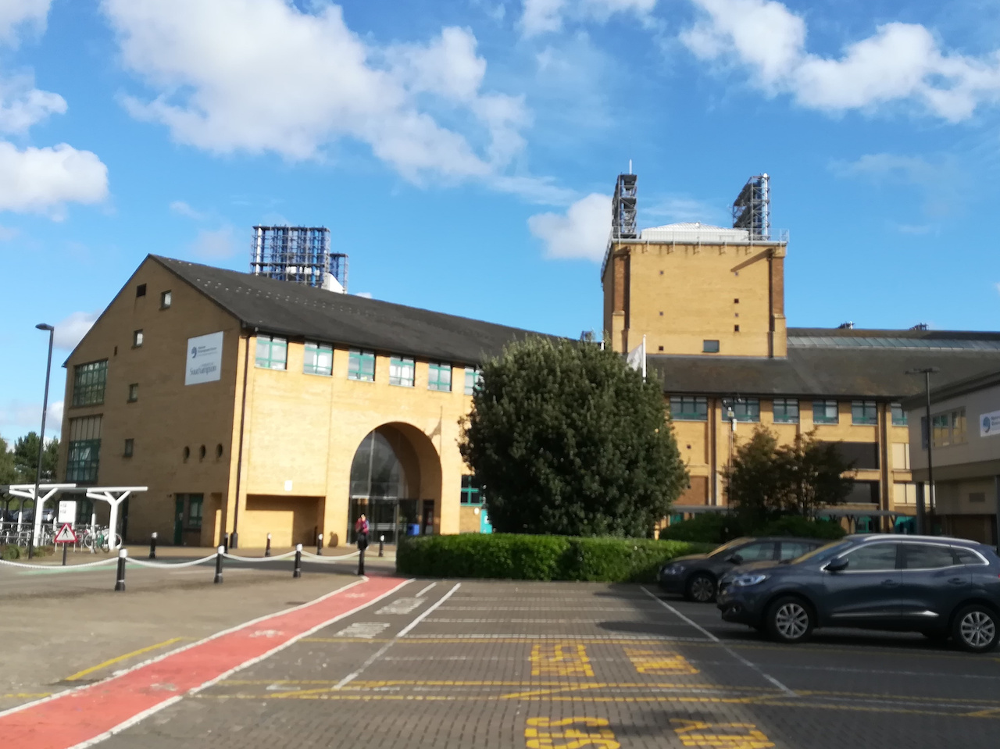

To mark the 30th anniversary of the National Oceanography Centre Southampton (NOCS), I wrote a short piece for the University of Southampton’s Digital Scholarship blog highlighting a selection of online collections and archival material available through the University’s Digital Library.

The post explores how photographs, reports, and other digitised material can offer insights into the history of oceanographic research and the institutional histories connected to NOCS, while also making these collections more accessible to wider audiences online.

You can read the blog post here: [30 Years of the National Oceanography Centre Southampton (NOCS): exploring ocean science through our digital collections | Inside Digital Scholarship](https://library.soton.ac.uk/digital-scholarship/inside-digital-scholarship/30yrs-nocs-through-digital-collections)

