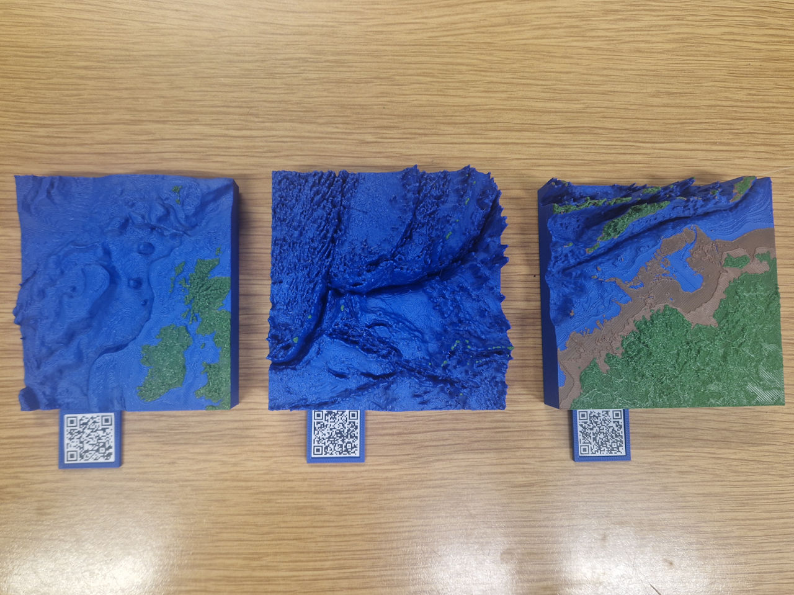

I'm delighted to share that my work *Submerged Worlds* is currently on display as part of the University of Southampton Summer Art Exhibition, *Exploration: Beyond Boundaries*, running from 3 June to 30 August 2026 in the Level 4 Gallery at Hartley Library.

The exhibition explores ideas of discovery, curiosity, and pushing beyond familiar limits. For me, that theme immediately brought to mind one of the least explored parts of our planet: the seafloor.

## About *Submerged Worlds*

Although oceans cover more than 70% of Earth's surface, much of the seafloor remains unseen and underexplored. We often think of exploration as something that happened in the past or takes place in distant parts of space, but there are still vast areas here on Earth that few people have ever encountered.

*Submerged Worlds* transforms seafloor data into tactile 3D-printed seascapes that can be explored through both sight and touch, making them accessible in a new way. The work sits somewhere between scientific visualisation and artistic interpretation, inviting visitors to engage with underwater environments that are normally hidden beneath the waves.

## Three 3D printed seascapes

The artwork features three different regions, each with its own story.

The first print reveals a complex Atlantic landscape of underwater banks, seamounts, ridges, and troughs around the granite islet **Rockall** (which is too small to be visible on the print itself!). It shows a region that highlights the connections between geology, ecology, and international politics, with important marine ecosystems existing alongside competing claims over resources and maritime boundaries.

**Challenger Deep**, located within the Mariana Trench, represents the deepest known point on Earth. Nearly 11 kilometres below sea level, it remains one of the most remote and difficult places to explore. Despite decades of scientific interest, only a handful of missions have ever reached its deepest depths.

**Bonaparte Gulf** offers a glimpse into a very different past. During periods of lower sea level, much of this now-submerged region formed part of the continent of Sahul, connecting Australia, New Guinea, and Tasmania. The landscape preserved beneath the water provides a window into environments encountered by some of the first people to reach the continent.

## From data to physical object

The project began with bathymetric datasets from the General Bathymetric Chart of the Oceans ([GEBCO](https://www.gebco.net/)). I processed the data in MATLAB to create digital terrain models, which were then transformed into physical 3D prints. 

The prints were produced in PLA, a plant-based bioplastic, using a Bambu Lab 3D printer through [Digital Scholarship](https://library.soton.ac.uk/c.php?g=708102&p=5105192) at the University of Southampton. To make subtle underwater features easier to perceive, the vertical scale has been exaggerated consistently across all three models.

Alongside the prints, I created accompanying maps using scientific colour palettes developed by [Fabio Crameri](https://www.fabiocrameri.ch/), helping to connect the physical models with the underlying data.

## Visit the exhibition

If you're in Southampton this summer, I'd love for you to stop by and experience the work in person. You're encouraged to touch the prints and explore their contours through your fingertips. One of the questions at the heart of Submerged Worlds is whether physical, tactile interaction can create a different experience of place than viewing a map or image alone. I would love to hear what you discover, please drop me a message on [Bluesky](https://bsky.app/profile/evelinekiki.bsky.social) and let me know!

**Exploration: Beyond Boundaries** 
University of Southampton Summer Art Exhibition 
Level 4 Gallery, Hartley Library 
3 June – 3 August 2026

For more infomation about the exhibition, see:
[Summer Art Exhibition - Exploration: Beyond Boundaries | Library Exhibitions and Events, University of Southampton](https://library.soton.ac.uk/library-exhibition-spaces/SummerExhibition2026)

Alongside each print you'll find a QR code linking to maps and further information about that particular region. I originally designed the website as a companion resource for visitors to the exhibition, helping to connect the tactile models with the underlying data and stories behind each seascape. However, you're very welcome to **browse it online** even if you can't make it to the exhibition. Take a peek online: [Submerged Worlds](https://submergedworlds.carrd.co/).