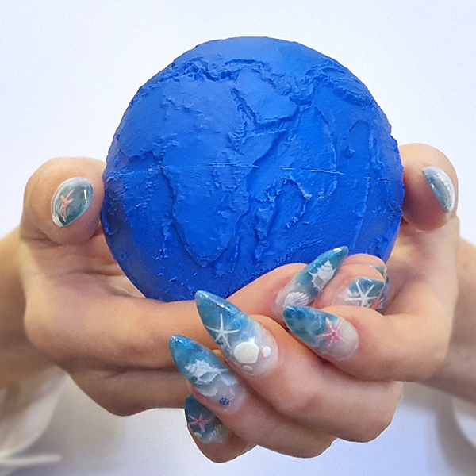

Can you hold a dataset in your hands?

At first glance, that might sound like a strange question. For me, though, it grew out of a longer interest in how we communicate spatial information and help people connect with the places represented by data. 

During my research into early seafaring, I spent a lot of time creating maps and thinking about how to communicate complex spatial information clearly. Maps are incredibly effective tools, but I often found myself wondering how to convey something more experiential: the scale of an ocean crossing, the shape of a landscape, or a sense of connection to a place.

That question stayed with me and eventually led me to data physicalisation.

In my latest post for [Inside Digital Scholarship](https://library.soton.ac.uk/digital-scholarship/inside-digital-scholarship/), I explore how [GEBCO](https://www.gebco.net/) bathymetric data can be transformed into a raised-relief 3D globe. What sounds like a straightforward idea quickly became a lesson in turning a concept into a practical outcome. Creating a printable globe involved much more than simply converting data into a model; it required balancing competing priorities, working within technical constraints, and making decisions about what details to preserve and what to simplify.

One of the things I enjoyed most about the project was the process itself. Every stage, from preparing the data and designing the model to troubleshooting print issues and refining the final result, involved planning, iteration, and problem-solving. It was a good reminder that successful projects are often less about finding a perfect solution and more about understanding constraints, adapting when things don't go to plan, and steadily improving through experimentation.

Along the way, I also learned a great deal about the practical realities of 3D printing and the possibilities (and limitations) of using physical models to communicate spatial information.

If you're interested in spatial data, digital scholarship, 3D printing, or learning through making, I hope you'll enjoy the post.

You can read it here: [Data physicalisation: from dataset to 3D globe | Inside Digital Scholarship](https://library.soton.ac.uk/digital-scholarship/inside-digital-scholarship/data-physicalisation-from-dataset-to-3d-globe)

